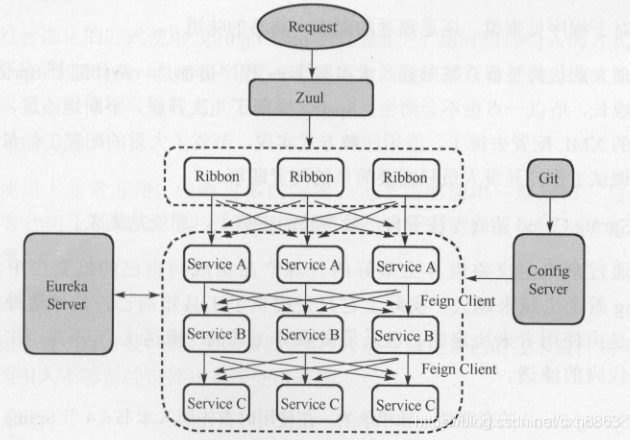

# 模块说明
|  模块   | 说明  |
|  ----  | ----  |
| springcloud-api  | 公共API |
| springcloud-consumer-dept-80  | 消费者ribbon |
| springcloud-consumer-dept-feign  | 消费者feign |
| springcloud-euerka-7001  | eureka服务提供者 |
| springcloud-euerka-7002  | eureka服务提供者 |
| springcloud-euerka-7003  | eureka服务提供者 |
| springcloud-provider-dept-8002  | 生产者 |
| springcloud-provider-dept-8003  | 生产者 |
| springcloud-provider-dept-8004  | 生产者 |
| springcloud-provider-dept-hystrix-8002  | 服务熔断器 |
| springcloud-consumer-hystrix-dashboard  | 监控仪表盘 |
| springcloud-zuul-9527  | 路由网关 |
| springcloud-config-client-3355  | git远程配置客户端，请求服务端 |
| springcloud-config-server-3344  | git远程配置服务端，请求github |

